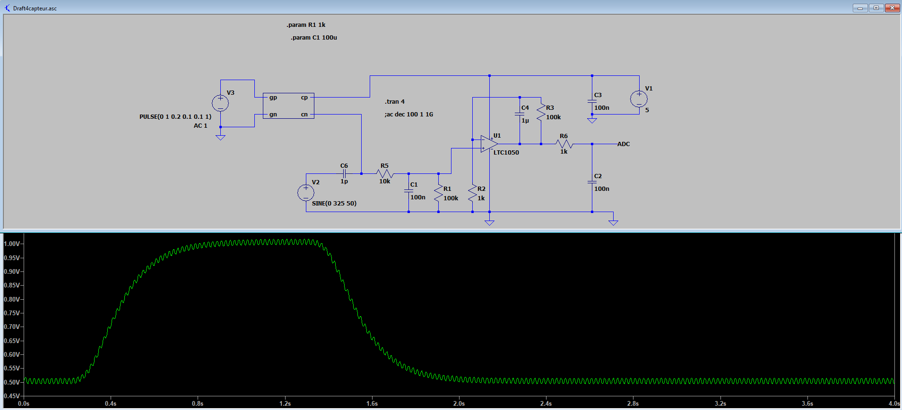
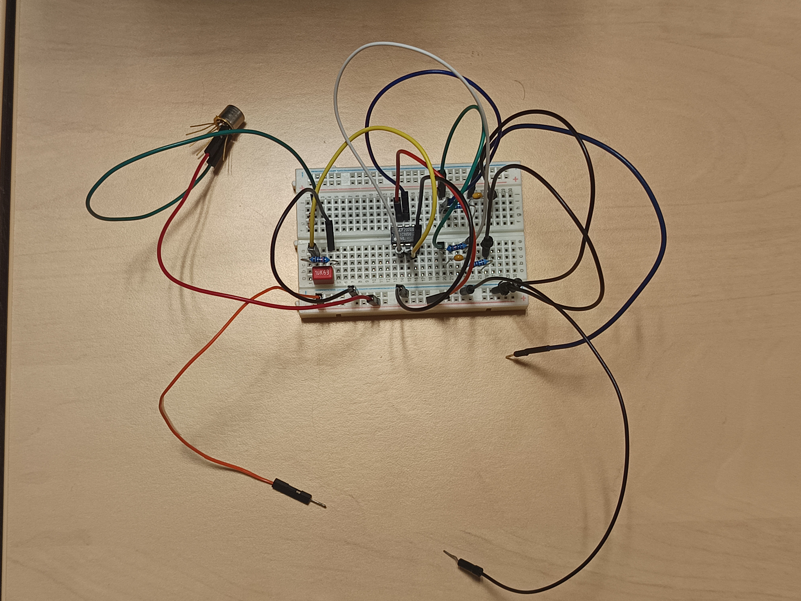
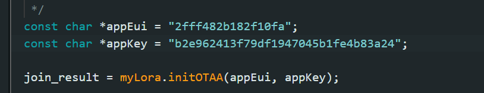
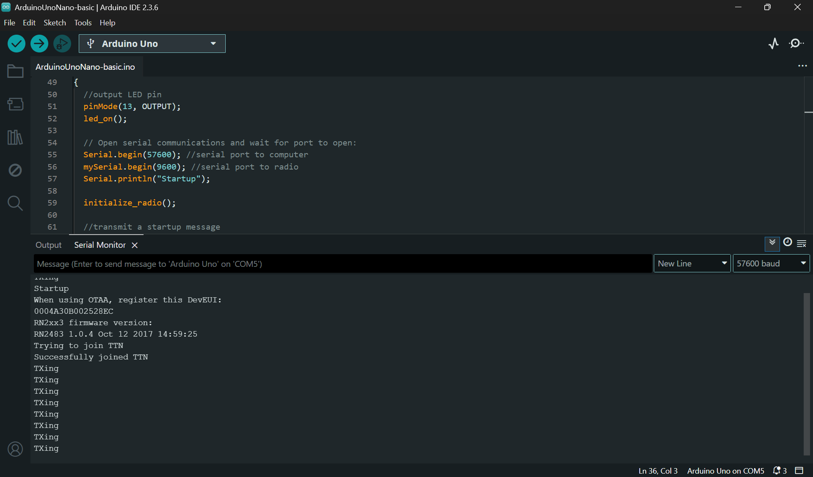
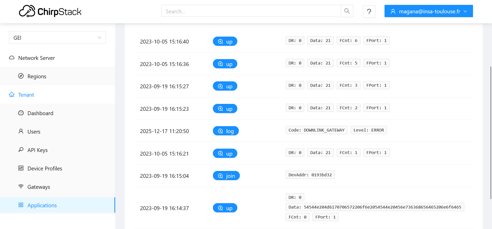

# MOSH

For the first part, we worked as group of 7 on the data sheet

I also worked with someone else for LTSpice labs.

After that, I took the decision to works alone for the rest of the project. With limited knowledge and time available, I've chosen to spend most of my time on making examples and practice labs works. It was, in my opinion, the best way to learn about all of the aspects of the project. I will describe here the results I was able to get, section by section.

## Kicad and boards:

I didn't finish the Kicad model of my project on time and wasn't able to print it to test it.
But I realized the complete equivalent with my captor on a board to visualize it better. Here is an image of it.

## LORA Connectivity

I spent time on managing to achieve a connection with the LORA gateway on top of GEI Building. 

## Application

I also followed the tutorial for the phone app development to make the LED blink. I was able to make it conclusive and test it in class. Here is a screenshot of my app.

## External documentation 

<https://www.analog.com/media/en/technical-documentation/data-sheets/1050fb.pdf>
<https://ww1.microchip.com/downloads/aemDocuments/documents/OTH/ProductDocuments/DataSheets/11195c.pdf>
<https://files.seeedstudio.com/wiki/Grove-Gas_Sensor/res/MQ-2.pdf>
